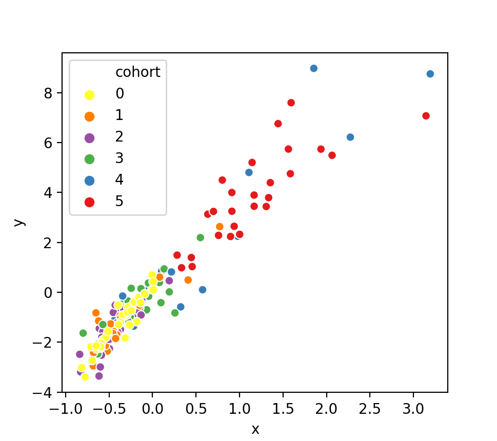
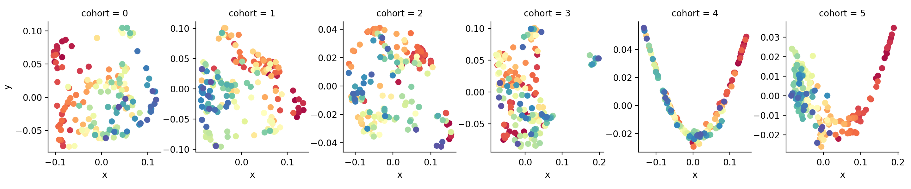
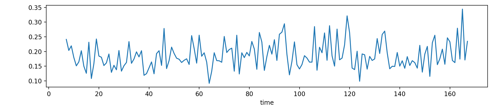
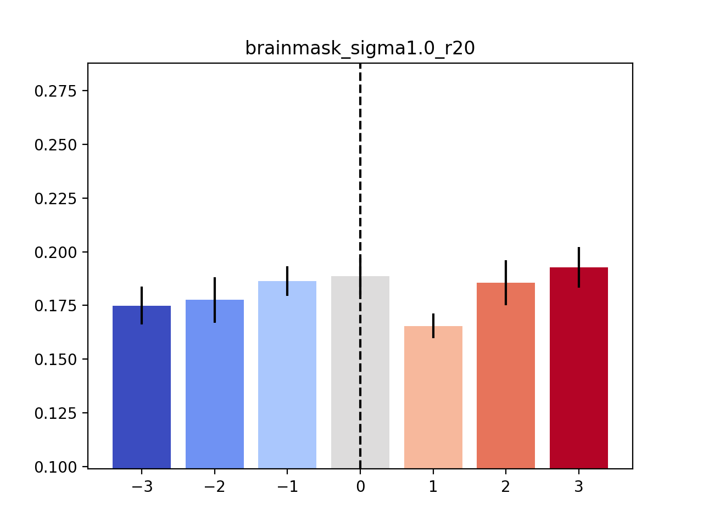
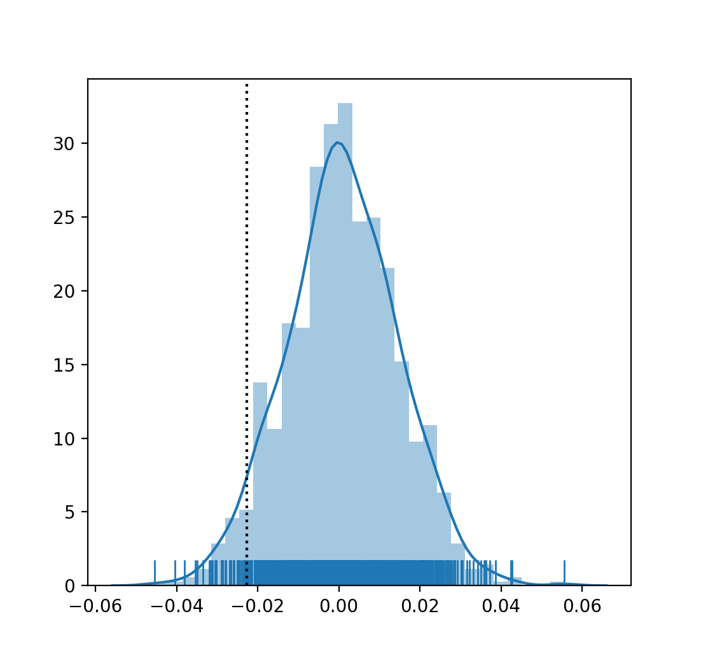

# Uncovering the Topology of Time-Varying fMRI Data using Cubical Persistence

This is the code for our paper *Uncovering the Topology of Time-Varying fMRI Data using Cubical Persistence*.
You will find numerous generated files such as a summary statistics and
embeddings in this repository. The raw fMRI data, however, are too large
to be easily re-distributed here. Please access them to under
https://openneuro.org/datasets/ds000228/versions/1.0.0.

The following instructions demonstrate how to use the package and how to
reproduce the experiments.

**Note to NeurIPS 2020 reviewers**: If you are reviewing this code, please be aware
that the size restrictions did *not* allow us to distribute the
'baseline' matrices and persistence images. Hence, you will *not* be
able to run all experiments out of the box. We do, however, provide all
generated files whenever possible, in particular the topological summary
statistics. If you want to take a look at these files, please download
the supplements from our OSF.io repository under https://osf.io/e86js/?view_only=7300c960263944f2b0115dd8cfac1203.

## Installing and using the package

The code requires [`poetry`](https://python-poetry.org) to be installed.
Please install this package using the suggested installation procedure
for your operating system. Afterwards, you can install the package as
follows:

```
poetry install
```

Please use `poetry shell` to start a shell in which the
package and its dependencies are installed. We will assume that all
commands are executed in the `ephemeral` code directory.

Subsequently, we will discuss how to reproduce the individual
experiments and plots.

## Summary statistics

The folder `results/summary_statistics` contains the results of the
summary statistics calculation as JSON files. The key is the participant
id, the value is a nested dictionary with the respective time series,
calculated based on one of the summary statistics mentioned in the
paper. Calculating these summary statistics by yourself is *not*
possible currently because it requires the raw data. However, the file
`ephemeral/scripts/calculate_summary_statistics.sh` shows how to perform
this calculation provided the raw data are available.

## Embedding experiment

**Note to NeurIPS 2020 reviewers**: Due to the size restrictions, we
cannot include the raw data required for the `baseline-tt` and
`baseline-pp` data sets. If you want to reproduce these results, please
take a look at our [OSF Project](https://osf.io/e86js/?view_only=7300c960263944f2b0115dd8cfac1203)
and download the code from there. Note that this does **not** apply to
the topological summary statistics; these summaries are sufficiently
small such that we can 'ship' them with the code.

That being said, to reproduce Figure 3a, 3b, 3c, and 3d, please run the
following commands:

    # For the topological summary statistics; notice that
    # 'total_persistence_p1' is the same as the 1-norm we
    # we used in the paper.
    python embed_summary_statistics.py  -s 'total_persistence_p1' ../results/summary_statistics/brainmask.json
    python embed_summary_statistics.py  -s 'infinity_norm_p1' ../results/summary_statistics/brainmask.json

    # For `baseline-tt` (see comments above concerning the data):
    python embed_baseline_autocorrelation.py ../results/baseline_autocorrelation/brainmask/*.npz

    # For `baseline-pp` (see comments above converning the data):
    python embed_baseline_autocorrelation.py ../results/baseline_autocorrelation_parcellated/brainmask/*.npz

Here is an example output file&nbsp;(showing the infinity norm summary
statistic embedding based on the whole-brain mask):



You can also calculate these embeddings for *other* masks, such as
`occipitalmask` or `xormask`. We have provided the necessary files
for this, but did *not* discuss them in the paper so far for space
reasons.

Please note that some of the plots might appear 'flipped' (with respect
to the y-axis); this only affects the visualisation, but not the
interpretation.

## Age prediction experiment

This reproduces Figure 3e in the paper.

**Note to NeurIPS 2020 reviewers**: Please note that due to the size
restrictions, we cannot include the raw data required for the
`baseline-tt` and `baseline-pp` data sets. If you want to reproduce
these results, please take a look at our [OSF
Project](https://osf.io/e86js/?view_only=7300c960263944f2b0115dd8cfac1203)
and download the code and data from there. Note that this does **not**
apply to the topological summary statistics; these summaries are
sufficiently small such that we can 'ship' them with the code.

To run the corresponding calculations, call the `predict_age.py` script
on different input data sets. The script is sufficiently smart to
automatically use the appropriate fitting method based on the input
data:

    # For the topological summary statistics. Again, they also work for
    # different brain masks (not showing all of them here). Please note
    # that `total_persistence_p1` is equivalent to the `p1_norm`, as we
    # describe it in the paper (the terminology in the paper was chosen
    # because it is more consistent).
    python predict_age.py -s 'total_persistence_p1' ../results/summary_statistics/brainmask.json
    python predict_age.py -s 'infinity_norm_p1' ../results/summary_statistics/brainmask.json

    # For the baseline-tt and baseline-pp experiments, respectively. For
    # both experiments, other brain masks are also available.
    python predict_age.py ../results/baseline_autocorrelation/brainmask/*.npz
    python predict_age.py ../results/baseline_autocorrelation/occipitalmask/*.npz
    python predict_age.py ../results/baseline_autocorrelation/xormask/*.npz
    python predict_age.py ../results/baseline_autocorrelation_parcellated/brainmask/*.npz
    python predict_age.py ../results/baseline_autocorrelation_parcellated/occipitalmask/*.npz
    python predict_age.py ../results/baseline_autocorrelation_parcellated/brainmask/*.npz

Here is an example output of what you get for the infinity norm
calculation:

    python predict_age.py -s 'infinity_norm_p1' ../results/summary_statistics/brainmask.json

    122it [00:00, 257.88it/s]
    R^2: 0.37
    Correlation coefficient: 0.61
    MSE: 3.38

You can see the R-squared coefficient&nbsp;(used for fitting the model),
the correlation coefficient&nbsp;(reported in the paper in the main
text), and the mean-squared-error&nbsp;(reported in the supplemental
materials in an extended version of the table that is shown in the main
paper).

## Variability analysis: Calculating cohort brain state trajectories

Please note that due to the size restrictions, we cannot include the
persistence images.  If you want to reproduce these results, please take a look at our
[OSF Project](https://osf.io/e86js/?view_only=7300c960263944f2b0115dd8cfac1203)
and download the code and data from there.

To calculate the cohort brain state trajectories shown in Figure 4, you
need to use the corresponding persistence images&nbsp;(these files are
also pre-computed because they involve the raw data). To visualise the
brain state trajectories for the whole-brain mask, for example, please
use the following call: 

    python visualise_cohort_trajectories.py -d ../results/persistence_images/brainmask_sigma1.0_r20.json

This will create a figure similar to this one:



Note that the *ordering* of cohorts has been swapped in the paper. As
we describe in the main text, we were 'blinded' to the actual ages of
the participants until the every end; hence, all visualisations are
shown using the original cohort labels.

The visualisation script offers additional options, which we did *not*
describe in the paper so far, such as a 'smoothing' process based on
rolling windows. Feel free to experiment by calling 

    python visualise_cohort_trajectories.py --help

to see the available options! This command-line argument is understood
by most of the tools that we provide, making it possible to explore the
code with ease.

The corresponding cohort trajectories that we  describe in the paper are
stored in the folder `results/cohort_trajectories`. Note that they might
be overwritten when calling the script.

## Variability analysis: Showing the event histograms

Please note that due to the size restrictions, we cannot include the
persistence images.  If you want to reproduce these results, please take a look at our
[OSF Project](https://osf.io/e86js/?view_only=7300c960263944f2b0115dd8cfac1203)
and download the code and data from there.

To create the across-cohort-variability data&nbsp;(that we subsequently
depict in Figure A.4 in the appendix and whose histograms are shown in
Figure 4 in the main text), you can use the following code:

    python analyse_variability_across_cohorts.py -d ../results/persistence_images/brainmask_sigma1.0_r20.json

This example would calculate the across-cohort variability curve of the
whole-brain mask and depict it. The figure in the paper&nbsp;(Figure A.4
in the supplemental materials) is improved in terms of the visualisation
and colour-coded according to the time, whereas the generated figure is
more 'plain-looking':



Please note that the `-d` parameter in the script above is crucial as it
removes the first time steps&nbsp;(during which a blank screen is shown).
In the other scripts, this removal happens automatically, but here, we
have an option for it&nbsp;(it has no influence on the calculation at
other time steps, but the curve itself looks slightly different from the
ones that we report in the paper in Figure A.4). As usual, you can also
run this script for the persistences images of the other brain masks.
The corresponding curves are stored in `results/across_cohort_variability`.

Finally, to convert these curves into the variability histograms that we
depict in Figure 4, please use the following code:

    python peri_histogram_analysis.py ../results/across_cohort_variability/brainmask_sigma1.0_r20.csv
    python peri_histogram_analysis.py ../results/across_cohort_variability/occipitalmask_sigma1.0_r20.csv
    python peri_histogram_analysis.py ../results/across_cohort_variability/xormask_sigma1.0_20.csv

This will result in a histogram like this one&nbsp;(here, the whole-brain mask is used):



## Variability analysis: Running the bootstrap experiments

Finally, to show the details of the bootstrap experiments concerning the
variability analysis, you can use the following code:

    python peri_histogram_bootstrap_analysis.py ../results/across_cohort_variability/brainmask_sigma1.0_r20.csv
    python peri_histogram_bootstrap_analysis.py ../results/across_cohort_variability/occipitalmask_sigma1.0_r20.csv
    python peri_histogram_bootstrap_analysis.py ../results/across_cohort_variability/xormask_sigma1.0_20.csv

By default, this will draw 1000 bootstrap samples and visualise the
corresponding histogram. Here is such a histogram&nbsp;(calculated based
on the occipital-temporal mask), with the *original* value of the
parameter being highlighted as a dotted vertical line:



The command-line output will show the numbers that we report in the
paper. For example, the analysis based on the occipital-temporal mask
will yield the following output:

    python peri_histogram_bootstrap_analysis.py -b 1000 ../results/across_cohort_variability/occipitalmask_sigma1.0_r20.csv
    Bootstrap: 100%|██████████████████████████████████████████████████████████████████████████████████████████████████████████████████████████████| 1000/1000 [00:15<00:00, 63.93it/s]
    Theta_0: -0.0226
    ASL (left) : 0.95
    ASL (right): 0.04

Hence, the parameter has an achieved significance level that is
significant at the 0.05 level.

## Additional code

The repository contains more code that we are unable to fully discuss or
acknowledge in the paper because of space reasons. Please feel free to
browse around; we documented most of the relevant scripts, making it possible
to get a glimpse into the full pipeline.
